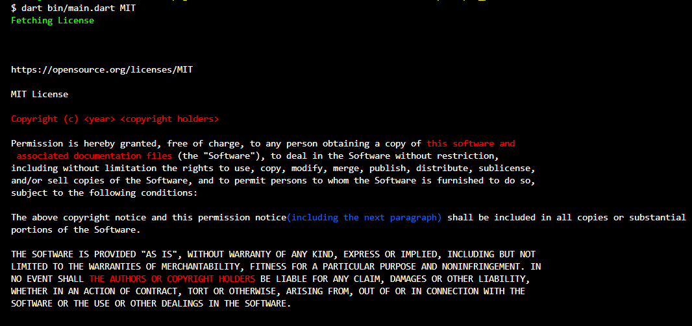

## SPDX License Printer

This is a sample dart project for fetching License from [SPDX repository](https://github.com/spdx/license-list-XML) and printing it to the console.

## Running this on your system:

For running this locally, you need to install [dart-sdk](https://dart.dev/get-dart).

Clone the Repository and run `dart pub get` to get the dependencies.

## Usage

Run `dart bin/main.dart <SPDX identifier>`

### Example

1. `cd spdx_printer`

2. `dart bin/main.dart MIT`

3. <em>Output</em>
   

## Color codes

The License printed on console uses some colors to represent important data present in license.

| Name             | Usage |
| ---------------- | ----- |
| Optional Text    | Blue  |
| Replaceable Text | Red   |
| Copyright Text   | Red   |
| Verbatim Text    | White |
